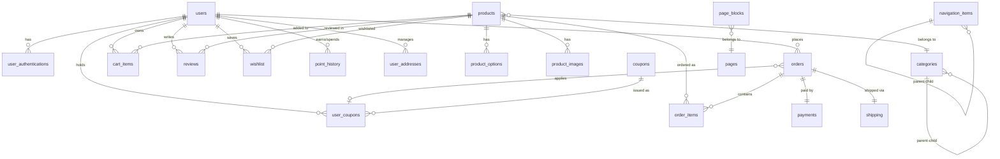

# Database

## Overview

- **Engine**: MySQL 8.0 (Docker Compose)
- **ORM**: TypeORM
- **Migration**: TypeORM CLI only (manual SQL forbidden)
- **Production**: `synchronize: true` strictly forbidden
- **Charset**: `utf8mb4` / Collation: `utf8mb4_unicode_ci`

---

## ER Diagram (Mermaid)



---

## Table Definitions

### users

| Column | Type | Constraints | Description |
|--------|------|-------------|-------------|
| `id` | `BIGINT` | PK, AUTO_INCREMENT | |
| `email` | `VARCHAR(255)` | UNIQUE, NOT NULL | Login email |
| `password` | `VARCHAR(255)` | NULL (OAuth users) | bcrypt hashed |
| `name` | `VARCHAR(100)` | NOT NULL | Display name |
| `phone` | `VARCHAR(20)` | NULL | Phone number |
| `role` | `ENUM('user','admin','super_admin')` | DEFAULT `'user'` | RBAC role |
| `is_active` | `BOOLEAN` | DEFAULT `true` | Account status |
| `refresh_token` | `VARCHAR(500)` | NULL | JWT Refresh Token (hashed) |
| `created_at` | `DATETIME` | DEFAULT `CURRENT_TIMESTAMP` | |
| `updated_at` | `DATETIME` | ON UPDATE `CURRENT_TIMESTAMP` | |

**Indexes**: `UQ_email`, `IDX_role`

---

### user_authentications

| Column | Type | Constraints | Description |
|--------|------|-------------|-------------|
| `id` | `BIGINT` | PK, AUTO_INCREMENT | |
| `user_id` | `BIGINT` | FK → `users.id`, NOT NULL | |
| `provider` | `ENUM('kakao','google')` | NOT NULL | OAuth provider |
| `provider_id` | `VARCHAR(255)` | NOT NULL | Provider-specific user ID |
| `access_token` | `TEXT` | NULL | OAuth access token (encrypted) |
| `created_at` | `DATETIME` | DEFAULT `CURRENT_TIMESTAMP` | |

**Indexes**: `UQ_provider_provider_id` (composite unique)

---

### user_addresses

| Column | Type | Constraints | Description |
|--------|------|-------------|-------------|
| `id` | `BIGINT` | PK, AUTO_INCREMENT | |
| `user_id` | `BIGINT` | FK → `users.id`, NOT NULL | |
| `label` | `VARCHAR(50)` | NULL | e.g. "Home", "Office" |
| `recipient_name` | `VARCHAR(100)` | NOT NULL | Recipient |
| `phone` | `VARCHAR(20)` | NOT NULL | |
| `zipcode` | `VARCHAR(10)` | NOT NULL | Postal code |
| `address` | `VARCHAR(255)` | NOT NULL | Base address |
| `address_detail` | `VARCHAR(255)` | NULL | Detail address |
| `is_default` | `BOOLEAN` | DEFAULT `false` | Default shipping address |
| `created_at` | `DATETIME` | DEFAULT `CURRENT_TIMESTAMP` | |
| `updated_at` | `DATETIME` | ON UPDATE `CURRENT_TIMESTAMP` | |

**Indexes**: `IDX_user_id`

---

### categories

| Column | Type | Constraints | Description |
|--------|------|-------------|-------------|
| `id` | `BIGINT` | PK, AUTO_INCREMENT | |
| `name` | `VARCHAR(100)` | NOT NULL | Category name |
| `slug` | `VARCHAR(100)` | UNIQUE, NOT NULL | URL-safe identifier |
| `parent_id` | `BIGINT` | FK → `categories.id`, NULL | Hierarchical tree (self-ref) |
| `sort_order` | `INT` | DEFAULT `0` | Display order |
| `is_active` | `BOOLEAN` | DEFAULT `true` | Visibility |
| `image_url` | `VARCHAR(500)` | NULL | Category thumbnail |
| `created_at` | `DATETIME` | DEFAULT `CURRENT_TIMESTAMP` | |

**Indexes**: `UQ_slug`, `IDX_parent_id`

---

### products

| Column | Type | Constraints | Description |
|--------|------|-------------|-------------|
| `id` | `BIGINT` | PK, AUTO_INCREMENT | |
| `category_id` | `BIGINT` | FK → `categories.id`, NULL | |
| `name` | `VARCHAR(255)` | NOT NULL | Product name |
| `slug` | `VARCHAR(255)` | UNIQUE, NOT NULL | URL-safe identifier |
| `description` | `TEXT` | NULL | Full description (HTML) |
| `short_description` | `VARCHAR(500)` | NULL | Summary for list view |
| `price` | `DECIMAL(12,2)` | NOT NULL | Base price (KRW) |
| `sale_price` | `DECIMAL(12,2)` | NULL | Discounted price |
| `stock` | `INT` | DEFAULT `0`, NOT NULL | Total stock count |
| `sku` | `VARCHAR(100)` | UNIQUE, NULL | Stock Keeping Unit |
| `status` | `ENUM('draft','active','soldout','hidden')` | DEFAULT `'draft'` | |
| `is_featured` | `BOOLEAN` | DEFAULT `false` | Homepage featured |
| `view_count` | `INT` | DEFAULT `0` | Page view counter |
| `created_at` | `DATETIME` | DEFAULT `CURRENT_TIMESTAMP` | |
| `updated_at` | `DATETIME` | ON UPDATE `CURRENT_TIMESTAMP` | |

**Indexes**: `UQ_slug`, `UQ_sku`, `IDX_category_id`, `IDX_status`, `IDX_is_featured`, `FULLTEXT_name` (search)

---

### product_options

| Column | Type | Constraints | Description |
|--------|------|-------------|-------------|
| `id` | `BIGINT` | PK, AUTO_INCREMENT | |
| `product_id` | `BIGINT` | FK → `products.id`, NOT NULL | ON DELETE CASCADE |
| `name` | `VARCHAR(100)` | NOT NULL | e.g. "Color", "Size" |
| `value` | `VARCHAR(100)` | NOT NULL | e.g. "Red", "XL" |
| `price_adjustment` | `DECIMAL(12,2)` | DEFAULT `0` | Additional price |
| `stock` | `INT` | DEFAULT `0` | Option-level stock |
| `sort_order` | `INT` | DEFAULT `0` | |

**Indexes**: `IDX_product_id`

---

### product_images

| Column | Type | Constraints | Description |
|--------|------|-------------|-------------|
| `id` | `BIGINT` | PK, AUTO_INCREMENT | |
| `product_id` | `BIGINT` | FK → `products.id`, NOT NULL | ON DELETE CASCADE |
| `url` | `VARCHAR(500)` | NOT NULL | Image URL |
| `alt` | `VARCHAR(255)` | NULL | Alt text |
| `sort_order` | `INT` | DEFAULT `0` | Display order |
| `is_thumbnail` | `BOOLEAN` | DEFAULT `false` | Primary image |

**Indexes**: `IDX_product_id`

---

### cart_items

| Column | Type | Constraints | Description |
|--------|------|-------------|-------------|
| `id` | `BIGINT` | PK, AUTO_INCREMENT | |
| `user_id` | `BIGINT` | FK → `users.id`, NOT NULL | ON DELETE CASCADE |
| `product_id` | `BIGINT` | FK → `products.id`, NOT NULL | |
| `product_option_id` | `BIGINT` | FK → `product_options.id`, NULL | |
| `quantity` | `INT` | NOT NULL, DEFAULT `1` | |
| `created_at` | `DATETIME` | DEFAULT `CURRENT_TIMESTAMP` | |
| `updated_at` | `DATETIME` | ON UPDATE `CURRENT_TIMESTAMP` | |

**Indexes**: `UQ_user_product_option` (composite unique — same item not duplicated)

---

### orders

| Column | Type | Constraints | Description |
|--------|------|-------------|-------------|
| `id` | `BIGINT` | PK, AUTO_INCREMENT | |
| `user_id` | `BIGINT` | FK → `users.id`, NOT NULL | |
| `order_number` | `VARCHAR(50)` | UNIQUE, NOT NULL | e.g. `ORD-20260323-XXXXX` |
| `status` | `ENUM('pending','paid','preparing','shipped','delivered','cancelled','refunded')` | DEFAULT `'pending'` | |
| `total_amount` | `DECIMAL(12,2)` | NOT NULL | Final total after discounts |
| `discount_amount` | `DECIMAL(12,2)` | DEFAULT `0` | Coupon + point discount |
| `shipping_fee` | `DECIMAL(12,2)` | DEFAULT `0` | |
| `recipient_name` | `VARCHAR(100)` | NOT NULL | |
| `recipient_phone` | `VARCHAR(20)` | NOT NULL | |
| `zipcode` | `VARCHAR(10)` | NOT NULL | |
| `address` | `VARCHAR(255)` | NOT NULL | |
| `address_detail` | `VARCHAR(255)` | NULL | |
| `memo` | `VARCHAR(500)` | NULL | Delivery memo |
| `user_coupon_id` | `BIGINT` | FK → `user_coupons.id`, NULL | Applied coupon |
| `points_used` | `INT` | DEFAULT `0` | Points redeemed |
| `created_at` | `DATETIME` | DEFAULT `CURRENT_TIMESTAMP` | |
| `updated_at` | `DATETIME` | ON UPDATE `CURRENT_TIMESTAMP` | |

**Indexes**: `UQ_order_number`, `IDX_user_id`, `IDX_status`, `IDX_created_at`

---

### order_items

| Column | Type | Constraints | Description |
|--------|------|-------------|-------------|
| `id` | `BIGINT` | PK, AUTO_INCREMENT | |
| `order_id` | `BIGINT` | FK → `orders.id`, NOT NULL | ON DELETE CASCADE |
| `product_id` | `BIGINT` | FK → `products.id`, NOT NULL | |
| `product_option_id` | `BIGINT` | FK → `product_options.id`, NULL | |
| `product_name` | `VARCHAR(255)` | NOT NULL | Snapshot at order time |
| `option_name` | `VARCHAR(100)` | NULL | Snapshot |
| `price` | `DECIMAL(12,2)` | NOT NULL | Unit price at order time |
| `quantity` | `INT` | NOT NULL | |

**Indexes**: `IDX_order_id`, `IDX_product_id`

---

### payments

| Column | Type | Constraints | Description |
|--------|------|-------------|-------------|
| `id` | `BIGINT` | PK, AUTO_INCREMENT | |
| `order_id` | `BIGINT` | FK → `orders.id`, UNIQUE, NOT NULL | 1:1 with order |
| `payment_key` | `VARCHAR(255)` | UNIQUE, NULL | PG transaction key |
| `method` | `ENUM('card','bank_transfer','virtual_account','phone','mock')` | NOT NULL | |
| `amount` | `DECIMAL(12,2)` | NOT NULL | Verified server-side amount |
| `status` | `ENUM('pending','confirmed','cancelled','partial_cancelled','refunded','failed')` | DEFAULT `'pending'` | |
| `gateway` | `ENUM('mock','toss','inicis')` | NOT NULL | PG adapter used. 현재 코드에서는 Stripe가 `inicis` placeholder로 저장되므로 `stripe` enum 추가 마이그레이션 필요 |
| `paid_at` | `DATETIME` | NULL | Confirmation timestamp |
| `cancelled_at` | `DATETIME` | NULL | |
| `cancel_reason` | `VARCHAR(500)` | NULL | |
| `raw_response` | `JSON` | NULL | PG response for audit |
| `created_at` | `DATETIME` | DEFAULT `CURRENT_TIMESTAMP` | |
| `updated_at` | `DATETIME` | ON UPDATE `CURRENT_TIMESTAMP` | |

**Indexes**: `UQ_order_id`, `UQ_payment_key`, `IDX_status`

**State Machine**:
```
pending → confirmed → partial_cancelled / cancelled / refunded
pending → failed
```

---

### shipping

| Column | Type | Constraints | Description |
|--------|------|-------------|-------------|
| `id` | `BIGINT` | PK, AUTO_INCREMENT | |
| `order_id` | `BIGINT` | FK → `orders.id`, UNIQUE, NOT NULL | 1:1 with order |
| `carrier` | `ENUM('mock','cj','hanjin','lotte')` | NOT NULL | Shipping provider |
| `tracking_number` | `VARCHAR(100)` | NULL | Waybill number |
| `status` | `ENUM('payment_confirmed','preparing','shipped','in_transit','delivered')` | DEFAULT `'payment_confirmed'` | |
| `shipped_at` | `DATETIME` | NULL | |
| `delivered_at` | `DATETIME` | NULL | |
| `created_at` | `DATETIME` | DEFAULT `CURRENT_TIMESTAMP` | |
| `updated_at` | `DATETIME` | ON UPDATE `CURRENT_TIMESTAMP` | |

**Indexes**: `UQ_order_id`, `IDX_tracking_number`, `IDX_status`

**State Machine**:
```
payment_confirmed → preparing → shipped → in_transit → delivered
```

실제 배송 정책에는 실패 상태(`failed`)가 포함된다. 상태 전이 문서와 DB enum은 코드 기준으로 동기화가 필요하다.

---

### reviews

| Column | Type | Constraints | Description |
|--------|------|-------------|-------------|
| `id` | `BIGINT` | PK, AUTO_INCREMENT | |
| `user_id` | `BIGINT` | FK → `users.id`, NOT NULL | |
| `product_id` | `BIGINT` | FK → `products.id`, NOT NULL | |
| `order_item_id` | `BIGINT` | FK → `order_items.id`, NULL | Links to purchased item |
| `rating` | `TINYINT` | NOT NULL, CHECK `1-5` | Star rating |
| `content` | `TEXT` | NULL | Review body |
| `image_urls` | `JSON` | NULL | Photo review images |
| `is_visible` | `BOOLEAN` | DEFAULT `true` | Admin moderation |
| `created_at` | `DATETIME` | DEFAULT `CURRENT_TIMESTAMP` | |
| `updated_at` | `DATETIME` | ON UPDATE `CURRENT_TIMESTAMP` | |

**Indexes**: `IDX_product_id`, `IDX_user_id`, `UQ_user_order_item` (one review per purchased item)

---

### wishlist

| Column | Type | Constraints | Description |
|--------|------|-------------|-------------|
| `id` | `BIGINT` | PK, AUTO_INCREMENT | |
| `user_id` | `BIGINT` | FK → `users.id`, NOT NULL | ON DELETE CASCADE |
| `product_id` | `BIGINT` | FK → `products.id`, NOT NULL | ON DELETE CASCADE |
| `created_at` | `DATETIME` | DEFAULT `CURRENT_TIMESTAMP` | |

**Indexes**: `UQ_user_product` (composite unique)

---

### coupons

| Column | Type | Constraints | Description |
|--------|------|-------------|-------------|
| `id` | `BIGINT` | PK, AUTO_INCREMENT | |
| `code` | `VARCHAR(50)` | UNIQUE, NOT NULL | Coupon code |
| `name` | `VARCHAR(255)` | NOT NULL | Display name |
| `type` | `ENUM('percentage','fixed')` | NOT NULL | Discount type |
| `value` | `DECIMAL(12,2)` | NOT NULL | Discount amount or % |
| `min_order_amount` | `DECIMAL(12,2)` | DEFAULT `0` | Minimum order threshold |
| `max_discount` | `DECIMAL(12,2)` | NULL | Cap for percentage type |
| `total_quantity` | `INT` | NULL | Total issuable count (NULL = unlimited) |
| `issued_count` | `INT` | DEFAULT `0` | Currently issued |
| `starts_at` | `DATETIME` | NOT NULL | Valid from |
| `expires_at` | `DATETIME` | NOT NULL | Valid until |
| `is_active` | `BOOLEAN` | DEFAULT `true` | |
| `created_at` | `DATETIME` | DEFAULT `CURRENT_TIMESTAMP` | |

**Indexes**: `UQ_code`, `IDX_is_active_expires_at`

---

### user_coupons

| Column | Type | Constraints | Description |
|--------|------|-------------|-------------|
| `id` | `BIGINT` | PK, AUTO_INCREMENT | |
| `user_id` | `BIGINT` | FK → `users.id`, NOT NULL | |
| `coupon_id` | `BIGINT` | FK → `coupons.id`, NOT NULL | |
| `status` | `ENUM('available','used','expired')` | DEFAULT `'available'` | |
| `used_at` | `DATETIME` | NULL | |
| `order_id` | `BIGINT` | FK → `orders.id`, NULL | Which order consumed it |
| `issued_at` | `DATETIME` | DEFAULT `CURRENT_TIMESTAMP` | |

**Indexes**: `IDX_user_id_status`, `UQ_user_coupon` (one coupon per user, unless re-issuable)

---

### point_history

| Column | Type | Constraints | Description |
|--------|------|-------------|-------------|
| `id` | `BIGINT` | PK, AUTO_INCREMENT | |
| `user_id` | `BIGINT` | FK → `users.id`, NOT NULL | |
| `type` | `ENUM('earn','spend','expire','admin_adjust')` | NOT NULL | |
| `amount` | `INT` | NOT NULL | Positive for earn, negative for spend |
| `balance` | `INT` | NOT NULL | Running balance after this transaction |
| `description` | `VARCHAR(255)` | NULL | e.g. "Order #ORD-... review reward" |
| `order_id` | `BIGINT` | FK → `orders.id`, NULL | Related order |
| `created_at` | `DATETIME` | DEFAULT `CURRENT_TIMESTAMP` | |

**Indexes**: `IDX_user_id_created_at`

---

### pages (CMS)

| Column | Type | Constraints | Description |
|--------|------|-------------|-------------|
| `id` | `BIGINT` | PK, AUTO_INCREMENT | |
| `slug` | `VARCHAR(100)` | UNIQUE, NOT NULL | URL path (e.g. `home`, `event-summer`) |
| `title` | `VARCHAR(255)` | NOT NULL | |
| `template` | `VARCHAR(100)` | DEFAULT `'default'` | Template identifier |
| `is_published` | `BOOLEAN` | DEFAULT `false` | |
| `created_at` | `DATETIME` | DEFAULT `CURRENT_TIMESTAMP` | |
| `updated_at` | `DATETIME` | ON UPDATE `CURRENT_TIMESTAMP` | |

**Indexes**: `UQ_slug`

---

### page_blocks (CMS)

| Column | Type | Constraints | Description |
|--------|------|-------------|-------------|
| `id` | `BIGINT` | PK, AUTO_INCREMENT | |
| `page_id` | `BIGINT` | FK → `pages.id`, NOT NULL | ON DELETE CASCADE |
| `type` | `VARCHAR(50)` | NOT NULL | e.g. `hero_banner`, `product_grid`, `text`, `image` |
| `content` | `JSON` | NOT NULL | Block-specific data |
| `sort_order` | `INT` | DEFAULT `0` | |
| `is_visible` | `BOOLEAN` | DEFAULT `true` | |
| `created_at` | `DATETIME` | DEFAULT `CURRENT_TIMESTAMP` | |
| `updated_at` | `DATETIME` | ON UPDATE `CURRENT_TIMESTAMP` | |

**Indexes**: `IDX_page_id_sort_order`

---

### navigation_items (CMS)

| Column | Type | Constraints | Description |
|--------|------|-------------|-------------|
| `id` | `BIGINT` | PK, AUTO_INCREMENT | |
| `group` | `VARCHAR(50)` | NOT NULL | e.g. `gnb`, `sidebar`, `footer` |
| `label` | `VARCHAR(100)` | NOT NULL | Display text |
| `url` | `VARCHAR(500)` | NOT NULL | Link target |
| `parent_id` | `BIGINT` | FK → `navigation_items.id`, NULL | Nested menu |
| `sort_order` | `INT` | DEFAULT `0` | |
| `is_active` | `BOOLEAN` | DEFAULT `true` | |
| `created_at` | `DATETIME` | DEFAULT `CURRENT_TIMESTAMP` | |

**Indexes**: `IDX_group_sort_order`, `IDX_parent_id`

---

## Relationship Summary

| Relationship | Type | FK / Constraint |
|---|---|---|
| users → orders | 1:N | `orders.user_id` → `users.id` |
| users → cart_items | 1:N | `cart_items.user_id` → `users.id` (CASCADE) |
| users → user_authentications | 1:N | `user_authentications.user_id` → `users.id` |
| users → user_addresses | 1:N | `user_addresses.user_id` → `users.id` |
| users → reviews | 1:N | `reviews.user_id` → `users.id` |
| users → wishlist | 1:N | `wishlist.user_id` → `users.id` (CASCADE) |
| users → user_coupons | 1:N | `user_coupons.user_id` → `users.id` |
| users → point_history | 1:N | `point_history.user_id` → `users.id` |
| categories → categories | Self-ref | `categories.parent_id` → `categories.id` |
| categories → products | 1:N | `products.category_id` → `categories.id` |
| products → product_options | 1:N | CASCADE delete |
| products → product_images | 1:N | CASCADE delete |
| products → cart_items | 1:N | `cart_items.product_id` |
| products → order_items | 1:N | `order_items.product_id` |
| products → reviews | 1:N | `reviews.product_id` |
| products → wishlist | 1:N | CASCADE delete |
| orders → order_items | 1:N | CASCADE delete |
| orders → payments | 1:1 | `payments.order_id` UNIQUE |
| orders → shipping | 1:1 | `shipping.order_id` UNIQUE |
| orders → user_coupons | N:1 | `orders.user_coupon_id` (nullable) |
| coupons → user_coupons | 1:N | `user_coupons.coupon_id` |
| pages → page_blocks | 1:N | CASCADE delete |
| navigation_items → navigation_items | Self-ref | `parent_id` |

---

## Index Strategy

| Purpose | Type | Examples |
|---------|------|---------|
| **Uniqueness** | UNIQUE | `users.email`, `products.slug`, `orders.order_number`, `coupons.code` |
| **FK Lookup** | B-Tree | All foreign key columns |
| **List Filtering** | B-Tree | `products.status`, `orders.status`, `shipping.status` |
| **Pagination** | B-Tree | `orders.created_at`, `products.created_at` |
| **Fulltext Search** | FULLTEXT | `products.name` |
| **Composite** | B-Tree | `cart_items(user_id, product_id, product_option_id)`, `IDX_group_sort_order` |

---

## Data Type Conventions

| Domain | Type | Notes |
|--------|------|-------|
| Price / Amount | `DECIMAL(12,2)` | KRW — no floating point |
| Points | `INT` | Integer only |
| ID (PK/FK) | `BIGINT` | Auto-increment |
| Short text | `VARCHAR(N)` | N by domain |
| Long text | `TEXT` | Description, review body |
| Structured data | `JSON` | Block content, image arrays, PG raw response |
| Boolean | `BOOLEAN` (TINYINT) | `true` / `false` |
| Timestamp | `DATETIME` | UTC, TypeORM `@CreateDateColumn` / `@UpdateDateColumn` |
| Enum | `ENUM(...)` | Defined at column level |

---

## Local Development

### Docker MySQL

```bash
cd backend
docker compose up -d      # Start MySQL
docker compose down -v     # Reset (volume cleanup)
```

### Environment Variables (`backend/.env`)

환경변수는 `backend/.env.example`을 참고하여 `backend/.env`에 설정합니다.

**주의**: `.env` 파일에는 실제 비밀번호/키가 포함되므로 **절대 Git에 커밋하지 않습니다**.

---

## Migration

### Commands (run from `backend/`)

```bash
npm run migration:generate -- migrations/MigrationName  # Generate from entity diff
npm run migration:run                                    # Apply pending
npm run migration:revert                                 # Rollback last
npm run migration:show                                   # Show status
```

### Schema Change Workflow

1. Modify entity file (`*.entity.ts`)
2. Generate migration: `npm run migration:generate -- migrations/MigrationName`
3. Review generated `up` / `down` methods
4. Apply to test DB: `TEST_DATABASE_URL=... ./scripts/sync-schema.sh test`
5. Run E2E tests: `npm run test:e2e`
6. **Commit entity + migration file together**

---

## DB Connection

| Environment | Connection |
|---|---|
| **Local** | `mysql://root:<pw>@127.0.0.1:3306/commerce` |
| **Test** | `TEST_DATABASE_URL` (DB name must contain `test`, e.g. `commerce_test`) |
| **Remote** | Via SSH tunnel |

### SSH Tunnel

```bash
cd backend/scripts
./start-ssh-tunnel.sh    # Start
./stop-ssh-tunnel.sh     # Stop
./check-database.sh      # Verify connection
```

---

## Test DB Isolation

- Always use a separate test database
- `SET FOREIGN_KEY_CHECKS = 0` before cleanup
- Drop tables in reverse FK dependency order
- Test DB is **schema-synced** (not migration-based) for speed

---

## Soft Delete vs Hard Delete

| Table | Strategy | Reason |
|-------|----------|--------|
| `users` | Soft (`is_active = false`) | Order history preservation |
| `orders`, `payments` | Never delete | Audit / legal compliance |
| `cart_items`, `wishlist` | Hard delete | No audit requirement |
| `reviews` | Soft (`is_visible = false`) | Admin moderation |
| `coupons` | Soft (`is_active = false`) | Historical reference |
| `audit_logs` | Retain 3 years minimum | Admin/security/payment audit trail |
| `product_images`, `product_options` | CASCADE with product | Owned by product |
| `page_blocks` | CASCADE with page | Owned by page |
